# Mash-Up Server Entity Relationship Diagram (ERD)

## Overview

| 항목 | 내용 |
|------|------|
| **총 엔티티 수** | 45개 |
| **도메인 영역** | 19개 |
| **기본 클래스** | BaseEntity (id, createdAt, updatedAt) |
| **ORM** | JPA/Hibernate |

---

## ERD Diagram (Mermaid)

```mermaid
erDiagram
    %% ===== MEMBER DOMAIN =====
    Member {
        Long id PK
        String name
        String identification UK
        String password
        Boolean privatePolicyAgreed
        MemberStatus status
        OsType osType
        String fcmToken
        Boolean newsPushNotificationAgreed
        Boolean danggnPushNotificationAgreed
        LocalDateTime lastPushCheckTime
        LocalDateTime createdAt
        LocalDateTime updatedAt
    }

    MemberGeneration {
        Long id PK
        Long member_id FK
        Long generation_id FK
        Platform platform
        String projectTeamName
        String role
        MemberGenerationStatus status
        LocalDateTime createdAt
        LocalDateTime updatedAt
    }

    MemberProfile {
        Long id PK
        Long memberId
        LocalDate birthDate
        String job
        String company
        String introduction
        String residence
        String socialNetworkServiceLink
        String githubLink
        String portfolioLink
        String blogLink
        String linkedInLink
        LocalDateTime createdAt
        LocalDateTime updatedAt
    }

    %% ===== GENERATION DOMAIN =====
    Generation {
        Long id PK
        Integer number
        LocalDate startedAt
        LocalDate endedAt
        LocalDateTime createdAt
        LocalDateTime updatedAt
    }

    %% ===== TEAM DOMAIN =====
    Team {
        Long teamId PK
        Long generation_id FK
        String name
        String createdBy
        LocalDateTime createdAt
        String updatedBy
        LocalDateTime updatedAt
    }

    %% ===== APPLICATION DOMAIN =====
    Applicant {
        Long applicantId PK
        String email
        String googleUserId
        String name
        String phoneNumber
        LocalDate birthdate
        String department
        String residence
        ApplicantStatus status
        LocalDateTime createdAt
        LocalDateTime updatedAt
    }

    Application {
        Long applicationId PK
        Long applicant_id FK
        Long application_form_id FK
        ApplicationStatus status
        Boolean privacyPolicyAgreed
        LocalDateTime submittedAt
        LocalDateTime createdAt
        LocalDateTime updatedAt
    }

    ApplicationForm {
        Long applicationFormId PK
        Long team_id FK
        String name
        String createdBy
        LocalDateTime createdAt
        String updatedBy
        LocalDateTime updatedAt
    }

    Question {
        Long questionId PK
        Long application_form_id FK
        String content
        Integer maxContentLength
        String description
        Boolean required
        QuestionType questionType
        LocalDateTime createdAt
        LocalDateTime updatedAt
    }

    Answer {
        Long answerId PK
        Long question_id FK
        String content
        LocalDateTime createdAt
        LocalDateTime updatedAt
    }

    ApplicationResult {
        Long applicationResultId PK
        Long application_id FK
        ApplicationScreeningStatus screeningStatus
        ApplicationInterviewStatus interviewStatus
        LocalDateTime interviewStartedAt
        LocalDateTime interviewEndedAt
        String interviewGuideLink
        LocalDateTime createdAt
        LocalDateTime updatedAt
    }

    Confirmation {
        Long confirmationId PK
        Long application_id FK
        ApplicantConfirmationStatus status
        String rejectionReason
        LocalDateTime createdAt
        LocalDateTime updatedAt
    }

    %% ===== SCHEDULE DOMAIN =====
    Schedule {
        Long id PK
        Long generation_id FK
        String name
        LocalDateTime startedAt
        LocalDateTime endedAt
        LocalDateTime publishedAt
        Boolean isCounted
        ScheduleStatus status
        ScheduleType scheduleType
        String notice
        Double latitude
        Double longitude
        LocalDateTime createdAt
        LocalDateTime updatedAt
    }

    Event {
        Long id PK
        Long schedule_id FK
        String eventName
        LocalDateTime startedAt
        LocalDateTime endedAt
        LocalDateTime createdAt
        LocalDateTime updatedAt
    }

    Content {
        Long id PK
        Long event_id FK
        String title
        String description
        LocalDateTime startedAt
        LocalDateTime createdAt
        LocalDateTime updatedAt
    }

    %% ===== ATTENDANCE DOMAIN =====
    Attendance {
        Long id PK
        Long member_id FK
        Long event_id FK
        AttendanceStatus status
        LocalDateTime createdAt
        LocalDateTime updatedAt
    }

    AttendanceCode {
        Long id PK
        Long event_id FK
        String code
        LocalDateTime attendanceCheckStartedAt
        LocalDateTime attendanceCheckEndedAt
        LocalDateTime latenessCheckStartedAt
        LocalDateTime latenessCheckEndedAt
        LocalDateTime createdAt
        LocalDateTime updatedAt
    }

    %% ===== ADMIN DOMAIN =====
    AdminMember {
        Long adminMemberId PK
        String username
        String password
        Position position
        String createdBy
        LocalDateTime createdAt
        String updatedBy
        LocalDateTime updatedAt
    }

    %% ===== DANGGN DOMAIN =====
    DanggnScore {
        Long id PK
        Long member_generation_id FK
        Long totalShakeScore
        Long danggnRankingRoundId
        LocalDateTime lastShakedAt
    }

    DanggnRankingRound {
        Long id PK
        Integer number
        LocalDateTime startedAt
        LocalDateTime endedAt
        Long generationId
    }

    DanggnRankingReward {
        Long id PK
        String comment
        Long firstPlaceRecordMemberId
        Long danggnRankingRoundId
        LocalDateTime createdAt
        LocalDateTime updatedAt
    }

    DanggnShakeLog {
        Long id PK
        Long member_generation_id FK
        Long shakeScore
        LocalDateTime createdAt
    }

    %% ===== MASHONG DOMAIN =====
    MashongMission {
        Long id PK
        MissionType missionType
        MissionRepeatType missionRepeatType
        MissionStrategyType missionStrategyType
        String name
    }

    MashongMissionLevel {
        Long id PK
        Long mission_id FK
        Long level
        Long missionGoalValue
        Long compensationValue
        String title
    }

    MashongAttendance {
        Long id PK
        Long member_generation_id FK
        LocalDateTime attendanceAt
    }

    MashongPopcorn {
        Long id PK
        Long memberGenerationId
        Long popcorn
    }

    PlatformMashong {
        Long id PK
        Long level_id FK
        Long generation_id FK
        Platform platform
        Long accumulatedPopcorn
    }

    PlatformMashongLevel {
        Long id PK
        Integer level
        Long goalPopcorn
    }

    %% ===== EMAIL DOMAIN =====
    EmailNotification {
        Long id PK
        Long admin_member_id FK
        Long generation_id FK
        String senderEmail
        String memo
        EmailTemplateName emailTemplateName
        LocalDateTime createdAt
        LocalDateTime updatedAt
    }

    EmailRequest {
        Long id PK
        Long email_notification_id FK
        Long application_id FK
        String messageId
        EmailRequestStatus status
        LocalDateTime createdAt
        LocalDateTime updatedAt
    }

    %% ===== OTHER DOMAINS =====
    BirthdayCard {
        Long id PK
        Long senderMemberId
        String senderMemberName
        Platform senderMemberPlatform
        Long recipientMemberId
        Long generationId
        String message
        String imageUrl
        LocalDateTime createdAt
    }

    CardImage {
        Long id PK
        String imageUrl
    }

    MemberPopup {
        Long id PK
        Long member_id FK
        Boolean isEnabled
        LocalDateTime lastViewedAt
        PopupType popupType
        LocalDateTime createdAt
        LocalDateTime updatedAt
    }

    PushHistory {
        Long id PK
        Long memberId
        PushType pushType
        String title
        String body
        LinkType linkType
        LocalDateTime createdAt
        LocalDateTime updatedAt
    }

    ScoreHistory {
        Long id PK
        Long generation_id FK
        Long member_id FK
        String type
        String name
        Double score
        LocalDateTime date
        String scheduleName
        Boolean isCanceled
        String memo
        LocalDateTime createdAt
        LocalDateTime updatedAt
    }

    Storage {
        Long id PK
        String keyString UK
        JSON valueMap
        LocalDateTime createdAt
        LocalDateTime updatedAt
    }

    Invite {
        Long id PK
        Long generation_id FK
        String code
        Platform platform
        Integer limitCount
        LocalDateTime startedAt
        LocalDateTime endedAt
        LocalDateTime createdAt
        LocalDateTime updatedAt
    }

    RecruitmentSchedule {
        Long recruitmentScheduleId PK
        Long generation_id FK
        RecruitmentScheduleEventName eventName UK
        LocalDateTime eventOccurredAt
        LocalDateTime createdAt
        LocalDateTime updatedAt
    }

    RandomMessage {
        Long id PK
        String message
        RandomMessageType type
    }

    RnbMeta {
        Long id PK
        String menuName
        RnbPolicy policy
        Integer menuOrder
        LocalDateTime createdAt
        LocalDateTime updatedAt
    }

    %% ===== RELATIONSHIPS =====
    Member ||--o{ MemberGeneration : "has"
    Member ||--o{ Attendance : "attends"
    Member ||--o{ MemberPopup : "has"
    Member ||--o{ ScoreHistory : "has"

    Generation ||--o{ MemberGeneration : "contains"
    Generation ||--o{ Team : "has"
    Generation ||--o{ Schedule : "has"
    Generation ||--o{ Invite : "has"
    Generation ||--o{ RecruitmentSchedule : "has"
    Generation ||--o{ PlatformMashong : "has"
    Generation ||--o{ EmailNotification : "has"
    Generation ||--o{ ScoreHistory : "has"

    Team ||--o{ ApplicationForm : "has"

    Applicant ||--o{ Application : "submits"
    ApplicationForm ||--o{ Application : "receives"
    ApplicationForm ||--o{ Question : "contains"
    Question ||--o{ Answer : "has"
    Application ||--|| ApplicationResult : "has"
    Application ||--|| Confirmation : "has"
    Application ||--o{ Answer : "contains"
    Application ||--o{ EmailRequest : "receives"

    Schedule ||--o{ Event : "contains"
    Event ||--o{ Content : "has"
    Event ||--|| AttendanceCode : "has"
    Event ||--o{ Attendance : "tracks"

    MemberGeneration ||--o{ DanggnScore : "earns"
    MemberGeneration ||--o{ DanggnShakeLog : "logs"
    MemberGeneration ||--o{ MashongAttendance : "attends"

    MashongMission ||--o{ MashongMissionLevel : "has"
    PlatformMashongLevel ||--o{ PlatformMashong : "defines"

    AdminMember ||--o{ EmailNotification : "sends"
    EmailNotification ||--o{ EmailRequest : "contains"
```



---

## Domain별 엔티티 상세

### 1. Member Domain (회원)

회원 관리의 핵심 엔티티입니다.

| 엔티티 | 테이블 | 설명 |
|--------|--------|------|
| **Member** | `member` | 회원 기본 정보 |
| **MemberGeneration** | `member_generation` | 회원-기수 연결 (플랫폼, 역할) |
| **MemberProfile** | `member_profile` | 회원 프로필 (SNS, 포트폴리오 등) |

```
Member (1) ──────< MemberGeneration (N) >────── Generation (1)
   │
   └── MemberProfile (별도 참조)
```

### 2. Generation Domain (기수)

활동 기수 정보입니다.

| 엔티티 | 테이블 | 설명 |
|--------|--------|------|
| **Generation** | `generation` | 기수 정보 (번호, 활동 기간) |

**연관 엔티티:** MemberGeneration, Team, Schedule, Invite, RecruitmentSchedule, PlatformMashong

### 3. Team Domain (팀)

플랫폼별 팀 정보입니다.

| 엔티티 | 테이블 | 설명 |
|--------|--------|------|
| **Team** | `team` | 팀 정보 (기수별) |

```
Generation (1) ──────< Team (N) >──────< ApplicationForm (N)
```

### 4. Application Domain (지원서)

채용 지원 관련 엔티티입니다.

| 엔티티 | 테이블 | 설명 |
|--------|--------|------|
| **Applicant** | `applicant` | 지원자 정보 (Google OAuth) |
| **Application** | `application` | 지원서 |
| **ApplicationForm** | `application_form` | 지원 양식 (질문 포함) |
| **Question** | `question` | 질문 항목 |
| **Answer** | `answer` | 답변 |
| **ApplicationResult** | `application_result` | 심사 결과 (서류/면접) |
| **Confirmation** | `confirmation` | 합격 확인 응답 |

```
Applicant (1) ──────< Application (N) >────── ApplicationForm (1)
                           │                        │
                           ├── ApplicationResult    └──< Question (N)
                           │                              │
                           ├── Confirmation               └──< Answer (N)
                           │
                           └──< Answer (N)
```

### 5. Schedule Domain (일정)

세미나/이벤트 일정 관리입니다.

| 엔티티 | 테이블 | 설명 |
|--------|--------|------|
| **Schedule** | `schedule` | 일정 (세미나 등) |
| **Event** | `event` | 이벤트 (일정 내 세션) |
| **Content** | `content` | 콘텐츠 (이벤트 내 발표 등) |

```
Generation (1) ──────< Schedule (N) >──────< Event (N) >──────< Content (N)
                                                │
                                                └── AttendanceCode (1)
```

### 6. Attendance Domain (출석)

출석 체크 관리입니다.

| 엔티티 | 테이블 | 설명 |
|--------|--------|------|
| **Attendance** | `attendance` | 출석 기록 |
| **AttendanceCode** | `attendance_code` | 출석 체크 코드 (QR) |

```
Member (1) ──────< Attendance (N) >────── Event (1)
                                            │
                                            └── AttendanceCode (1)
```

### 7. Danggn Domain (당근 게임)

당근 흔들기 게임 관련입니다.

| 엔티티 | 테이블 | 설명 |
|--------|--------|------|
| **DanggnScore** | `danggn_score` | 당근 점수 |
| **DanggnRankingRound** | `danggn_ranking_round` | 랭킹 라운드 |
| **DanggnRankingReward** | `danggn_ranking_reward` | 랭킹 보상 |
| **DanggnShakeLog** | `danggn_shake_log` | 흔들기 로그 |
| **DanggnNotificationMemberRecord** | `danggn_notification_member_record` | 알림 기록 (개인) |
| **DanggnNotificationPlatformRecord** | `danggn_notification_platform_record` | 알림 기록 (플랫폼) |

```
MemberGeneration (1) ──────< DanggnScore (N)
                     ──────< DanggnShakeLog (N)
```

### 8. Mashong Domain (마숑 펫)

마숑 펫 육성 관련입니다.

| 엔티티 | 테이블 | 설명 |
|--------|--------|------|
| **MashongMission** | `mashong_mission` | 미션 정의 |
| **MashongMissionLevel** | `mashong_mission_level` | 미션 레벨 |
| **MashongMissionLog** | `mashong_mission_log` | 미션 진행 로그 (개인) |
| **MashongMissionTeamLog** | `mashong_mission_team_log` | 미션 진행 로그 (팀) |
| **MashongAttendance** | `mashong_attendance` | 마숑 출석 |
| **MashongPopcorn** | `mashong_popcorn` | 팝콘 보유량 |
| **PlatformMashong** | `platform_mashong` | 플랫폼별 마숑 상태 |
| **PlatformMashongLevel** | `platform_mashong_level` | 마숑 레벨 정의 |

```
MashongMission (1) ──────< MashongMissionLevel (N)

PlatformMashongLevel (1) ──────< PlatformMashong (N) >────── Generation (1)

MemberGeneration (1) ──────< MashongAttendance (N)
```

### 9. Email Domain (이메일)

이메일 발송 관리입니다.

| 엔티티 | 테이블 | 설명 |
|--------|--------|------|
| **EmailNotification** | `email_notification` | 이메일 발송 내역 |
| **EmailRequest** | `email_request` | 개별 이메일 요청 |

```
AdminMember (1) ──────< EmailNotification (N) >──────< EmailRequest (N)
                              │                              │
                              └── Generation                 └── Application
```

### 10. Admin Domain (관리자)

관리자 계정 관리입니다.

| 엔티티 | 테이블 | 설명 |
|--------|--------|------|
| **AdminMember** | `admin_member` | 관리자 계정 |

### 11. Birthday Domain (생일)

생일 카드 기능입니다.

| 엔티티 | 테이블 | 설명 |
|--------|--------|------|
| **BirthdayCard** | `birthday_card` | 생일 카드 |
| **CardImage** | `card_image` | 기본 카드 이미지 |

### 12. Other Domains (기타)

| 엔티티 | 테이블 | 설명 |
|--------|--------|------|
| **MemberPopup** | `member_popup` | 회원 팝업 설정 |
| **PushHistory** | `push_history` | 푸시 알림 이력 |
| **ScoreHistory** | `score_history` | 점수 이력 |
| **Storage** | `storage` | Key-Value 저장소 |
| **Invite** | `invite` | 초대 코드 |
| **RecruitmentSchedule** | `recruitment_schedule` | 채용 일정 |
| **RandomMessage** | `danggn_today_message` | 랜덤 메시지 |
| **RnbMeta** | `rnb_meta` | RNB 메타데이터 |

---

## Enum 타입 정리

### Member 관련

| Enum | 값 | 설명 |
|------|-----|------|
| **MemberStatus** | `ACTIVE`, `PENDING`, `INACTIVE` | 회원 상태 |
| **MemberGenerationStatus** | `ACTIVE`, `DROP_OUT` | 기수 참여 상태 |
| **OsType** | `ANDROID`, `IOS` | 디바이스 OS |
| **Platform** | `SPRING`, `ANDROID`, `IOS`, `WEB`, `NODE`, `DESIGN` | 플랫폼 |

### Application 관련

| Enum | 값 | 설명 |
|------|-----|------|
| **ApplicationStatus** | `CREATED`, `SAVED`, `SUBMITTED` | 지원서 상태 |
| **ApplicantStatus** | `ACTIVE`, `INACTIVE` | 지원자 상태 |
| **ApplicationScreeningStatus** | `NOT_RATED`, `PASSED`, `FAILED` | 서류 심사 결과 |
| **ApplicationInterviewStatus** | `NOT_RATED`, `PASSED`, `FAILED` | 면접 결과 |
| **ApplicantConfirmationStatus** | `TO_BE_DETERMINED`, `CONFIRMED`, `REJECTED` | 합격 확인 응답 |
| **QuestionType** | `SINGLE_LINE_TEXT`, `MULTIPLE_LINE_TEXT` | 질문 유형 |

### Schedule 관련

| Enum | 값 | 설명 |
|------|-----|------|
| **ScheduleStatus** | `ADMIN_ONLY`, `PUBLIC` | 일정 공개 상태 |
| **ScheduleType** | `ALL`, `SPRING`, `IOS`, `DESIGN`, `WEB`, `NODE`, `ANDROID` | 일정 유형 |
| **AttendanceStatus** | `PRESENT`, `ABSENT`, `LATE` | 출석 상태 |

### Other

| Enum | 설명 |
|------|------|
| **Position** | 관리자 직급 |
| **EmailTemplateName** | 이메일 템플릿 |
| **EmailRequestStatus** | 이메일 요청 상태 |
| **PopupType** | 팝업 유형 |
| **PushType** | 푸시 알림 유형 |
| **LinkType** | 푸시 링크 유형 |
| **MissionType** | 미션 유형 |
| **MissionRepeatType** | 미션 반복 유형 |
| **MissionStrategyType** | 미션 전략 유형 |

---

## 관계 요약

### OneToMany 관계 (12개)

| Parent | Child | 설명 |
|--------|-------|------|
| Member | MemberGeneration | 회원의 기수별 참여 |
| Member | Attendance | 회원의 출석 기록 |
| Generation | Team, Schedule, Invite 등 | 기수별 데이터 |
| ApplicationForm | Question | 양식의 질문들 |
| Application | Answer | 지원서의 답변들 |
| Schedule | Event | 일정의 이벤트들 |
| Event | Content | 이벤트의 콘텐츠들 |
| EmailNotification | EmailRequest | 이메일 발송 요청들 |
| MashongMission | MashongMissionLevel | 미션 레벨들 |

### OneToOne 관계 (3개)

| Entity A | Entity B | 설명 |
|----------|----------|------|
| Application | ApplicationResult | 지원서 - 심사결과 |
| Application | Confirmation | 지원서 - 합격확인 |
| Event | AttendanceCode | 이벤트 - 출석코드 |

---

## 특이사항

1. **BaseEntity 패턴**: 대부분의 엔티티가 `id`, `createdAt`, `updatedAt`을 상속
2. **Lazy Loading**: 모든 연관관계에 `FetchType.LAZY` 적용
3. **비정규화**: `BirthdayCard`, `MashongMissionLog` 등은 FK 대신 ID 값을 직접 저장
4. **Embedded 타입**: `Schedule`의 `Location` (위도, 경도)
5. **JSON Converter**: `Storage`의 `valueMap`은 JSON으로 변환하여 저장
6. **Audit 필드**: Spring Data의 `@CreatedDate`, `@LastModifiedDate`, `@CreatedBy`, `@LastModifiedBy` 사용
